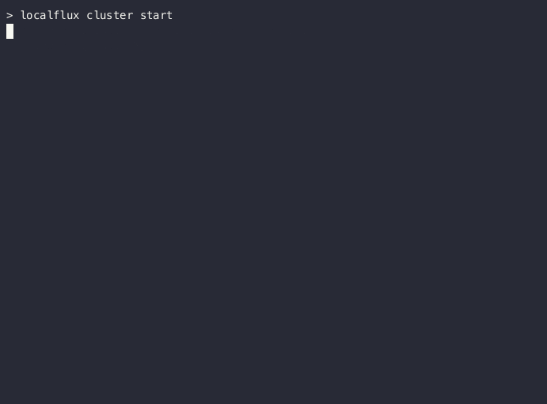
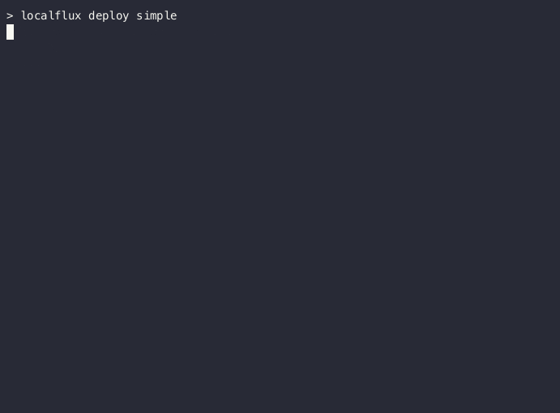

# localflux
Fast local k8s development using Flux CD & Minikube.

## 🗝️ Key Features

- 📝 **YAML Config** - YAML based configuration, designed to be committed to your repo.
- 🛠️ **Flux CD** - Built on top of [Flux CD](https://fluxcd.io/), giving you the same high-quality Kustomization & Helm support you already use in production.
- 🗃️ **Minikube** - Automatically deploy and configure minikube.
- 🌐 **Inbuilt port-forwarding** - Access any service or pod inside your cluster.

## ⚙️ Prerequisites

1. [Golang](https://go.dev/) (with `.go/bin` in your `$PATH`)
2. [Minikube](https://minikube.sigs.k8s.io/docs/start/)
3. Docker

## 📦 Installation

To install `localflux`, simply:

```bash
go install github.com/csnewman/localflux/cmd/localflux@latest
```

Ensure you have at least one buildkit builder:
```bash
docker buildx create
```

## 🪧 Usage

Clone demo:
```bash
git clone https://github.com/csnewman/localflux.git
cd localflux/demo
```

Start minikube cluster:
```bash
localflux cluster start
```

<div align="center">
  
</div>

Deploy demo (named `simple`)
```bash
localflux deploy simple
```

<div align="center">
  
</div>

Visit http://localhost:8080/ to see the demo in action!

## 🛠️ Configuration

Create a `localflux.yaml` file at the root of your project:

```yaml
apiVersion: flux.local/v1alpha1
kind: Config
defaultCluster: minikube
clusters:
  - name: minikube
    minikube:
      # Define a hostname for the in-cluster image registry:
      registryAliases:
        - example.invalid
      # Enable nginx-ingres:
      addons:
        - ingress
      # Enable calico for netpol support:
      cni: calico
    # Start the relay container on the host machine and inside the cluster for port-forwarding:
    relay:
      enabled: true
deployments:
  # Define an example deployment with multiple steps:
  - name: simple
    images:
      # Build a Docker image, and automatically upload to the cluster:
      - image: example.invalid/hello
        context: hello
    steps:
      # Deploy a helm chart from a remote repository:
      - name: podinfo
        helm:
          repo: https://stefanprodan.github.io/podinfo
          chart: podinfo
          version: '6.5.*'
          namespace: podinfo
          values:
            replicaCount: 1
      # Deploy some local kustomization files:
      - name: core
        kustomize:
          context: deploy
          namespace: demo
    portForward:
      # Port forward :8080 on the host to port 80 on the ingres-nginx service:
      - kind: Service
        namespace: ingress-nginx
        name: ingress-nginx-controller
        port: 80
        localPort: 8080
      # Port forward :8081 on the host to port 8081 on the pods in the deployment:
      - kind: Deployment
        namespace: demo
        name:  the-deployment
        port: 8080
        localPort: 8081
```

All configuration options can be found [here](https://github.com/csnewman/localflux/blob/master/internal/config/v1alpha1/config.go).
